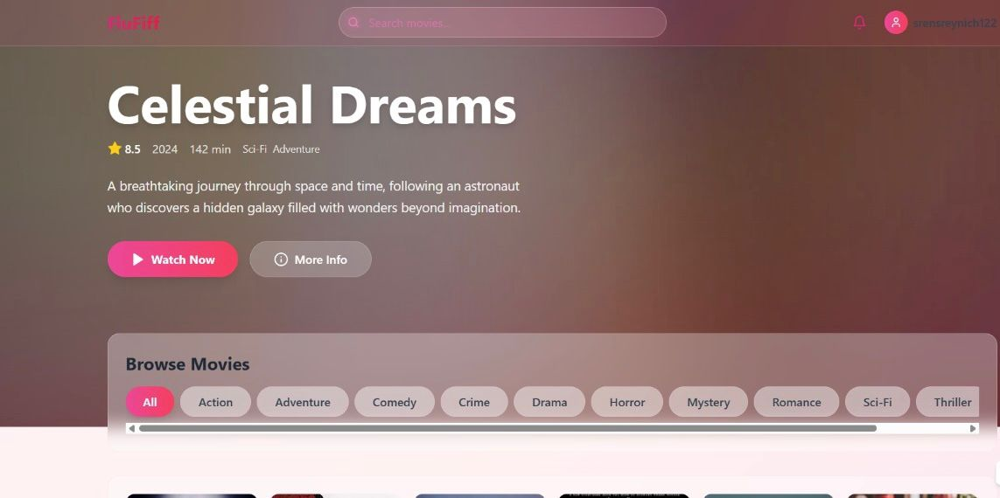
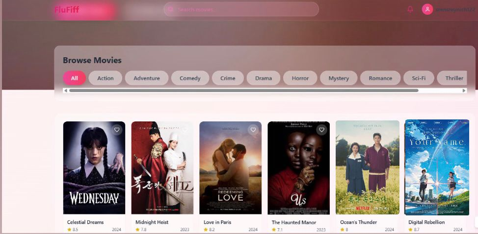

# 🎬 Flufiff

Flufiff is a **cute and cozy movie streaming website concept** inspired by platforms like Netflix.  
It allows users to explore movies by genre, check details, and enjoy a soft, modern UI with a fluffy aesthetic.  

---

## ✨ Features
- 🔍 **Search Movies** – Quickly find movies by title.  
- 🎭 **Browse by Genre** – Action, Adventure, Comedy, Drama, Romance, Sci-Fi, Thriller & more.  
- 📖 **Movie Details** – View description, ratings, release year, and categories.  
- ❤️ **Favorites** – Save movies you love.  
- 🌙 **Modern UI** – Soft colors, rounded cards, and a cozy vibe.  

---

## 📸 Screenshots
### Home Page


### Browse Movies


---

## 🛠️ Tech Stack
- **Frontend:** HTML, CSS, JavaScript (or React.js if you’re using it)  
- **Styling:** TailwindCSS / Custom CSS  
- **Backend (Optional):** Node.js / Express  
- **Database (Optional):** MongoDB / Firebase  
- **API (Optional):** [The Movie Database (TMDb)](https://www.themoviedb.org/)  

---

## 🚀 Getting Started
1. Clone the repository:
   ```bash
   git clone https://github.com/your-username/flufiff.git
